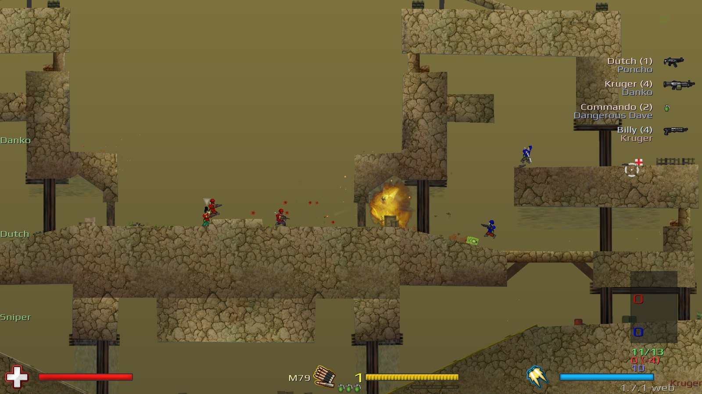
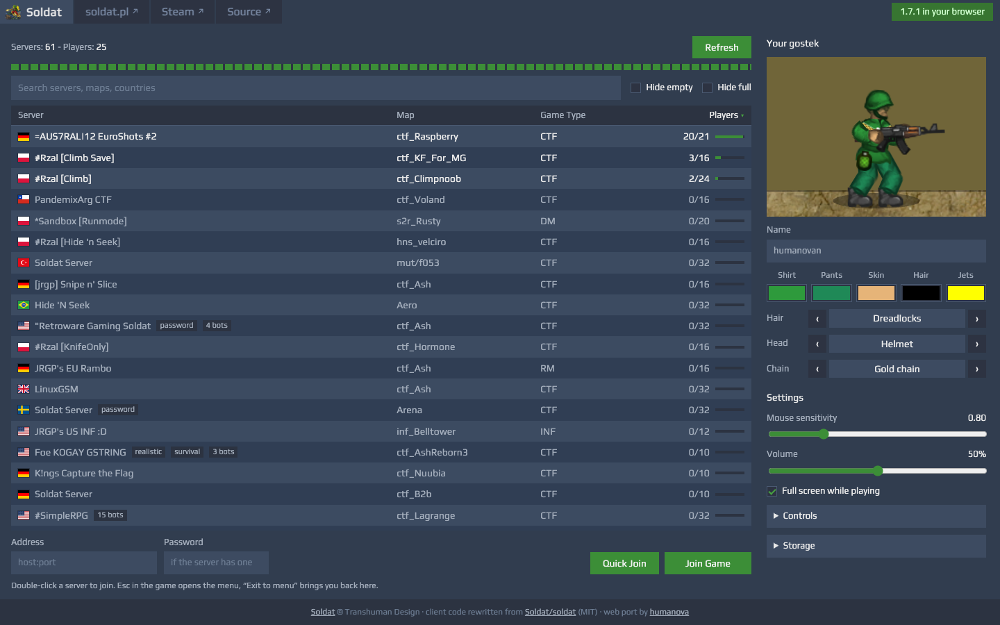
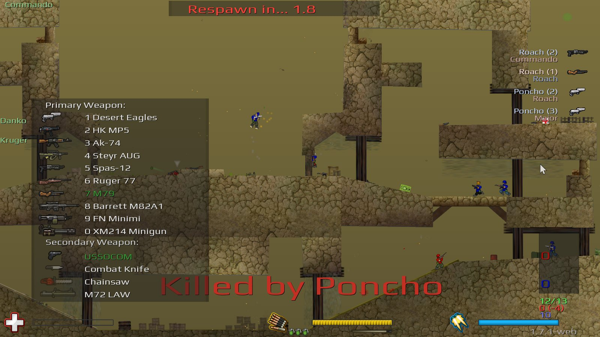

# Soldat Web

Soldat 1.7.1 in your browser, on the official public servers.
Pick a server from the same list the game shows and press Join.



This is the Soldat client compiled to WebAssembly, with its
network code rewritten to speak the 1.7.1 protocol. It started from the [open source codebase](https://github.com/soldat/soldat), but restoring 1.7.1 behavior required reverse-engineering the current official
client and server binaries to roll back divergences in that code base, as well as porting
the rendering and platform layers.

Browsers can't send UDP, so a small Node.js relay passes the game's packets
between the page and the game server.

## Play

You need [Node.js](https://nodejs.org) 18 or newer.
The built game is part of this repository, so there's nothing to
compile. Clone the repository and then run:

```bash
node relay/server.mjs
```

Then open <http://localhost:8080>.

1. Set up your gostek on the right. The preview uses the game's own sprites, skeleton
  and animation. Standing on the map of the server you select.
2. Pick a server and press **Join**, or double-click it. **Quick join** takes you to the
   busiest server that has room.



A few extras:

- `http://localhost:8080/?join=1.2.3.4:23073` fills in a server address.
- `?debug=1` prints the game console and network messages to the browser's developer
  console.
- With "Full screen while playing" on, Chrome and Edge let the game have keys like Esc
  and Ctrl+W.
- `Alt+F3` in the game shows the frame rate and ping.

## What works

Everything you do in a round: moving, jets, all weapons and grenades, team and
spectator mode, chat, team chat, radio, the scoreboard and kill feed, and map changes.
Joining works for any game mode.

Vote menus and
kick or ban messages work like in the original but haven't been tested end to end.

Maps the browser doesn't have, custom maps included, are downloaded from the game server
the same way the original client does it. Settings and downloaded maps stay in your
browser.

The game renders at your screen's resolution and refresh rate, and keeps the original's
look: the same FreeType version for text, the same texture settings, and the compressed
sounds decoded the way SDL decodes them.

**Doesn't support**: Recording and playing demos.



## Host it for others

The relay serves the page, proxies the server list and map downloads, and forwards the
game traffic. Put it behind a reverse proxy that handles HTTPS and passes WebSocket
upgrades on `/relay` (pages served over HTTPS must use `wss://`). Each player uses about
10 to 30 KB/s.

| Setting | Default | What it does |
|---|---|---|
| `--port` / `PORT` | 8080 | HTTP port |
| `--root` / `ROOT` | `web/` | folder with the client |
| `--allow` / `ALLOW` | none | extra `host:port` game servers to allow (by default only servers in the Soldat lobby) |
| `ALLOW_ANY=1` | off | allow any server (private setups only) |
| `ORIGINS` | same origin | other sites allowed to use the relay (`*` for any) |
| `TRUST_PROXY=1` | off | take the client address from `X-Forwarded-For` |
| `MAX_SESSIONS_PER_IP` | 4 | game and download sessions per visitor |

Good to know before you open it to the public:

- Everyone on your relay reaches game servers from the relay's IP address, so an IP ban
  on one of them bans all of them. Each browser still gets its own hardware ID, which
  servers can ban instead.
- A 1.7.1 server blocks an address that sends more than 18 join requests in about 16
  seconds. The relay spaces out joins per server (at most 14 per 17 seconds), so when
  many players join at once, some wait a few seconds.
- WebSockets run over TCP. On a lossy connection one lost packet holds up the ones behind
  it, which real UDP wouldn't do. On a good connection you won't notice.

## Build it yourself

On macOS with Homebrew:

```bash
brew install fpc llvm wasi-libc innoextract node
tools/setup-fpc.sh                  # Free Pascal cross-compiler for WebAssembly -> ~/fpc-wasm
c/build-c.sh                        # FreeType 2.6.1 and stb_image -> c/obj/
tools/fetch-assets.sh assets-src    # game data: Soldat base + the official 1.7.1 files
python3 tools/build-assets.py --base assets-src/base --v171 assets-src/app --out web
./build.sh                          # -> web/soldat.wasm
```

On Debian Linux:

```bash
sudo apt update
sudo apt install fpc clang wasi-libc innoextract nodejs git curl patch python3 build-essential
tools/setup-fpc.sh                  # Free Pascal cross-compiler for WebAssembly -> ~/fpc-wasm
LLVM=/usr/bin WASI_SYSROOT=/usr c/build-c.sh  # FreeType 2.6.1 and stb_image -> c/obj/
tools/fetch-assets.sh assets-src    # game data: Soldat base + the official 1.7.1 files
python3 tools/build-assets.py --base assets-src/base --v171 assets-src/app --out web
./build.sh                          # -> web/soldat.wasm
```

Homebrew also runs on Linux, but this project's C build defaults use its macOS install
paths. Use your distribution's packages and the Linux command above, or pass the matching
`LLVM` and `WASI_SYSROOT` paths for your Homebrew installation.

`tools/setup-fpc.sh` builds a pinned Free Pascal trunk commit with one small patch for
its WebAssembly linker. Set `FPCROOT=...` for `build.sh` if you install it elsewhere.

About the game data: the pack prefers the files of the official 1.7.1 download
(freeware, © Transhuman Design, all rights reserved), because that's what servers run.
The [base game content](https://github.com/opensoldat/base) is CC BY 4.0. For a pack you
can share freely, leave out `--v171`: anything a map needs that the base set lacks is then
downloaded from the game server, like for any custom map.


## How it works

```
 browser                                   relay (Node.js)              Soldat 1.7.1 server
 ┌───────────────────────────────┐        ┌──────────────────┐         ┌──────────────────┐
 │ soldat.wasm (Pascal client)   │  WS    │ /relay: WS <-> UDP│  UDP    │ game port        │
 │  WebGL2 / WebAudio / input    │<──────>│ file server proxy │<──────> │ port+10: files   │
 │ js/: WASI FS, SDL, GL, AL,    │  HTTP  │ /api/servers      │  HTTPS  │ lobby API        │
 │      PhysFS, net             │<──────>│ static files      │<──────> │                  │
 └───────────────────────────────┘        └──────────────────┘         └──────────────────┘
```

- `src/`: the Soldat client in Pascal, built with `-dWEB`. `src/shared/network/` holds the
  rewritten 1.7.1 network code; [docs/PROTOCOL-1.7.1.md](docs/PROTOCOL-1.7.1.md) describes
  the protocol. `src/web/` replaces SDL2, OpenGL, OpenAL, PhysFS and Steam with small
  units implemented in JavaScript.
- `c/`: FreeType 2.6.1 (patched for WebAssembly, see `c/freetype-wasm.patch`) and
  stb_image, compiled with clang and linked into the module.
- `web/js/`: the browser side: a file system with IndexedDB storage, WebGL 2 (the game's
  shaders are translated to GLSL ES), WebAudio, input, the relay client and the menu.
- `web/soldat.smod`: the game data. Map textures and scenery are in `web/assets/`.
- `relay/server.mjs`: the relay. No dependencies.

## Credits and license

Soldat was created by Michal Marcinkowski and © Transhuman Design. Get the original
game at [soldat.pl](https://soldat.pl/en/) or on
[Steam](https://store.steampowered.com/app/638490/Soldat/).

The code in this repository is MIT licensed, see [LICENSE](LICENSE). It is the Soldat
client by Transhuman Design and contributors ([Soldat/soldat](https://github.com/Soldat/soldat))
plus the web port by [humanova](https://github.com/humanova).

The game data is not covered by that license: `web/soldat.smod` and `web/assets/` hold
files of Soldat 1.7.1 (freeware, © Transhuman Design, all rights reserved) and of the
[base game content](https://github.com/opensoldat/base) (CC BY 4.0).

Also included: the Play font by Jonas Hecksher (SIL Open Font License 1.1), stb_image
(public domain) and FreeType (FreeType License). Portions of this software are copyright
© 2015 The FreeType Project (www.freetype.org). All rights reserved.
