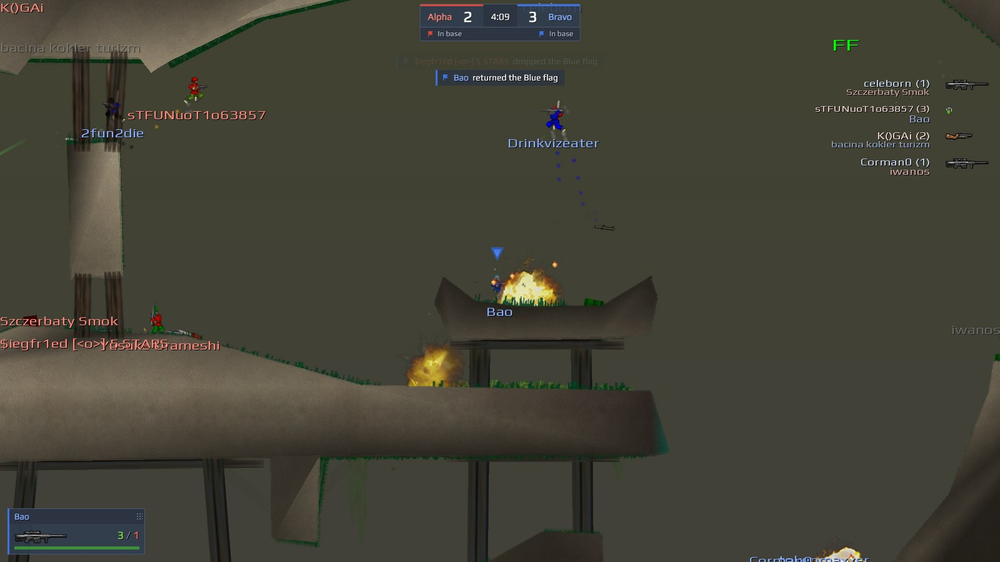
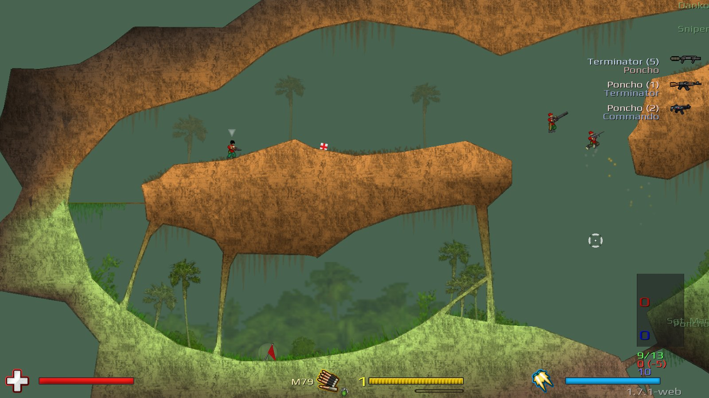

# Soldat Web

Soldat 1.7.1 in your browser, on the official public servers.
See the [demo video](https://youtu.be/rnsfcZrFU7s), or watch live matches at
[soldat.live](https://soldat.live).



This is the Soldat client compiled to WebAssembly, with its
network code rewritten to speak the 1.7.1 protocol. It started from the [open source codebase](https://github.com/soldat/soldat), but restoring 1.7.1 behavior required reverse-engineering the current official
client and server binaries to roll back divergences in that code base, as well as porting
the rendering and platform layers.

Browsers can't send UDP, so a small Node.js relay passes the game's packets
between the page and the game server.

## Play

You need [Node.js](https://nodejs.org) 18 or newer.
The built game is part of this repository, so there's nothing to
compile. Clone the repository and then run:

```bash
node relay/play.mjs
```

Then open <http://localhost:8080>.

1. Set up your gostek on the right. The preview uses the game's own sprites, skeleton
  and animation. Standing on the map of the server you select.
2. Pick a server and press **Join**, or double-click it. **Quick join** takes you to the
   busiest server that has room.


A few extras:

- `http://localhost:8080/?join=1.2.3.4:23073` fills in a server address.
- With "Full screen while playing" on, Chrome and Edge let the game have keys like Esc
  and Ctrl+W.
- `Alt+F3` in the game shows the frame rate and ping.

## What works

Everything you do in a round: moving, jets, all weapons and grenades, team and
spectator mode, chat, team chat, radio, the scoreboard and kill feed, and map changes.
Joining works for any game mode.

Maps the browser doesn't have, custom maps included, are downloaded from the game server
the same way the original client does it. Settings and downloaded maps stay in your
browser.

The game renders at your screen's resolution and refresh rate, and keeps the original's
look: the same texture settings, and the compressed sounds decoded the way SDL decodes them.

**Doesn't support**: Recording and playing demos.



## Host it for others

The relay serves the page, proxies the server list and map downloads, and forwards the
game traffic. Put it behind a reverse proxy that handles HTTPS and passes WebSocket
upgrades on `/relay` (pages served over HTTPS must use `wss://`). Each player uses about
10 to 30 KB/s.

| Setting | Default | What it does |
|---|---|---|
| `--port` / `PORT` | 8080 | HTTP port |
| `--root` / `ROOT` | `web/` | folder with the client |
| `--allow` / `ALLOW` | none | extra `host:port` game servers to allow (by default only servers in the Soldat lobby) |
| `ALLOW_ANY=1` | off | allow any server (private setups only) |
| `--servers` / `SERVER_LIST` | none | a Soldat TV config (`relay/spectator.json`): only its servers can be joined and are listed |
| `ORIGINS` | same origin | other sites allowed to use the relay (`*` for any) |
| `TRUST_PROXY=1` | off | take the client address from `X-Forwarded-For` |
| `MAX_SESSIONS_PER_IP` | 4 | game and download sessions per visitor |
| `DISCORD_CLIENT_ID` | none | turns on Discord sign-in, which is then required to play (see below) |
| `DISCORD_CLIENT_SECRET` | none | the Discord app's client secret |
| `PUBLIC_URL` | none | the page's address, such as `https://play.soldat.live` |
| `AUTH_SECRET` | none | 32+ random characters; signs sessions and makes the hardware IDs |
| `MIN_ACCOUNT_AGE_DAYS` | 30 | younger Discord accounts can't play |
| `BLOCKED_DISCORD_IDS` | none | comma separated Discord IDs that may not use the relay |

Good to know before you open it to the public:

- Everyone on your relay reaches game servers from the relay's IP address, so an IP ban
  on one of them bans all of them. Players have their own hardware IDs, which servers
  can ban instead. Without Discord sign-in, each browser makes up its own.
- Every server the relay joins sees that address, and anyone can put a server in the
  lobby. With `SERVER_LIST` only servers you chose see it.
- A 1.7.1 server blocks an address that sends more than 18 join requests in about 16
  seconds. The relay spaces out joins per server (at most 14 per 17 seconds), so when
  many players join at once, some wait a few seconds.
- WebSockets run over TCP. On a lossy connection one lost packet holds up the ones behind
  it, which real UDP wouldn't do. On a good connection you won't notice.

### Discord sign-in

With sign-in on, players sign in with Discord once (30 days) before they can join. The
relay then gives each account the same hardware ID on every server, whatever the browser
sends, so a server can ban a player without banning the relay. Nothing is stored: the
session is a signed cookie, and the relay's log has a line for each game with the
Discord ID, name and hardware ID.

1. Create an application at https://discord.com/developers/applications and add
   `<PUBLIC_URL>/auth/callback` under OAuth2 → Redirects.
2. Start the relay with `DISCORD_CLIENT_ID` (the application ID), `DISCORD_CLIENT_SECRET`,
   `PUBLIC_URL` and `AUTH_SECRET` (for example `openssl rand -hex 32`). Keep `AUTH_SECRET`:
   a new one gives every player a new hardware ID, and their bans no longer match.

Map downloads need sign-in too. An account can be in two games at a time, and each game
may send at most 120 messages and 16 KB a second (a busy player sends about 25 and well
under 1 KB). To lock an account out of the relay, add its Discord ID (from the log) to
`BLOCKED_DISCORD_IDS` and restart the relay.

Behind Cloudflare, let nginx take the visitor's address from `CF-Connecting-IP` only when
the request comes from Cloudflare (`set_real_ip_from` with
[Cloudflare's ranges](https://www.cloudflare.com/ips/), `real_ip_header CF-Connecting-IP`)
and pass `X-Forwarded-For $remote_addr`. Otherwise anyone who reaches the server directly
can claim any address and get around the limit per visitor.

For server admins: the server's log shows the hardware ID when a player joins
(`Name joining game (ip:port) HWID:0123456789A`). Ban it with `/banhw 0123456789A`.
`/ban` bans the address too, which is the relay's: it locks out everyone playing from it.

## Soldat TV

Watch live matches in the browser without joining them, like at
[soldat.live](https://soldat.live).

`relay/spectator.mjs` joins each server in its config once, as a spectator, and streams
that one connection to everyone watching. Viewers can't play or talk to the players, and
can only watch the servers in the config.

```bash
cp relay/spectator.example.json relay/spectator.json   # list the servers to watch
node relay/spectator.mjs
```

Then open <http://localhost:8090> and pick a server. The camera follows the action by
itself, or you can follow one player, look around, or see the whole map. The score, flag
news, chat and the followed player's card are on screen. Phones work held sideways.

Every server has its own link, `/<id>`. Servers with a `group` get their own tab in the
list. With `askPassword`, the server's password comes from a viewer instead of the
config: a link can carry it, `/<id>?password=...`, or the page asks. Once it works,
anyone can watch, and the hub keeps it until the server's password changes.

Viewers can chat with each other: everyone on the site (Global), or only the people
watching the same server. While watching, the Soldat TV chat window (Enter) shows both, each
line tagged with its channel, and checkboxes pick the channels. One connection per page
carries them all. Viewers pick a nickname, with no account. The hub keeps the last 10
minutes in memory and allows one line every 1.5 seconds per address.

Servers with `record` get their matches recorded while Soldat TV watches them, one demo
per map. Their tab lists the recorded matches (map, score, length, players): each one plays
on the site at `/replay?id=<demo>`, with pause, speed (¼× to 4×) and a timeline to drag
through the match (captures are marked on it), and downloads as a `.sdm` file. Demos are
kept gzipped in `recordings.dir`; the hub drops ones shorter than a minute or with fewer
than two players, and removes the oldest after `keepDays` or once all of them take more
than `maxGB`. A match is published once it ends (plus the server's broadcast delay).

| Setting | Default | What it does |
|---|---|---|
| `--port` / `PORT` | 8090 | HTTP port |
| `servers` | none | servers to watch: `id`, `name`, `host`, `port`, optional `password`, `delaySeconds`, `group`, `askPassword` and `record` |
| `playerName` | `[soldat.live] Soldat TV` | the spectator's name on the servers (at most 23 characters) |
| `delaySeconds` | 0 | broadcast delay, so players can't use the stream to spy on each other |
| `lingerSeconds` | 60 | how long it stays on a server after the last viewer leaves |
| `maxViewers` | 500 | viewers in total |
| `maxViewersPerIp` | 3 | viewers per visitor |
| `maxChatPerIp` | 2 | chat connections per visitor (one for each open page) |
| `origins` | same origin | other sites allowed to use it |
| `trustProxy` | off | take the client address from `X-Forwarded-For` |
| `recordings` | | `dir` (`data/recordings` next to the config), `keepDays` (14), `maxGB` (5), `minSeconds` (60), `minPlayers` (2) |

Good to know:

- Each server needs a free spectator slot (`Max_Spectators`). Ask its admins before you
  add it.
- A server sends frequent updates only around the player a spectator follows, so players
  far from the camera (as in the map view) move less smoothly. Recordings hold the same
  stream, following the director's camera.
- A recorded match takes about 2.5 KB a second, gzipped to about two thirds: some 6 MB for an
  hour of play.

## Build it yourself

On macOS with Homebrew:

```bash
brew install fpc llvm wasi-libc innoextract node
tools/setup-fpc.sh                  # Free Pascal cross-compiler for WebAssembly -> ~/fpc-wasm
c/build-c.sh                        # FreeType 2.6.1 and stb_image -> c/obj/
tools/fetch-assets.sh assets-src    # game data: Soldat base + the official 1.7.1 files
python3 tools/build-assets.py --base assets-src/base --v171 assets-src/app --out web
./build.sh                          # -> web/soldat.wasm, web/soldat-spectate.wasm
```

On Debian Linux:

```bash
sudo apt update
sudo apt install fpc clang wasi-libc innoextract nodejs git curl patch python3 build-essential
tools/setup-fpc.sh                  # Free Pascal cross-compiler for WebAssembly -> ~/fpc-wasm
LLVM=/usr/bin WASI_SYSROOT=/usr c/build-c.sh  # FreeType 2.6.1 and stb_image -> c/obj/
tools/fetch-assets.sh assets-src    # game data: Soldat base + the official 1.7.1 files
python3 tools/build-assets.py --base assets-src/base --v171 assets-src/app --out web
./build.sh                          # -> web/soldat.wasm, web/soldat-spectate.wasm
```

`tools/setup-fpc.sh` builds a pinned Free Pascal trunk commit with one small patch for
its WebAssembly linker. Set `FPCROOT=...` for `build.sh` if you install it elsewhere.
`./build.sh play` or `./build.sh spectate` builds one of the two clients.

The pack prefers the files of the official 1.7.1 download (freeware, © Transhuman Design, all rights reserved), because that's what servers run.
The [base game content](https://github.com/opensoldat/base) is CC BY 4.0. For a pack you
can share freely, leave out `--v171`: anything a map needs that the base set lacks is then
downloaded from the game server, like for any custom map.


## How it works

```
 browser                                   relay (Node.js)              Soldat 1.7.1 server
 ┌───────────────────────────────┐        ┌──────────────────┐         ┌──────────────────┐
 │ soldat.wasm (Pascal client)   │  WS    │/relay: WS <-> UDP│  UDP    │ game port        │
 │  WebGL2 / WebAudio / input    │<──────>│ file server proxy│<──────> │ port+10: files   │
 │ js/: WASI FS, SDL, GL, AL,    │  HTTP  │   /api/servers   │  HTTPS  │ lobby API        │
 │      PhysFS, net              │<──────>│   static files   │<──────> │                  │
 └───────────────────────────────┘        └──────────────────┘         └──────────────────┘
```

- `src/`: the Soldat client in Pascal, built with `-dWEB` (`soldatweb.lpr`). The spectator
  (`soldatspectate.lpr`) is the same client built with `-dSPECTATOR` plus `src/spectator/`.
  `src/shared/network/` holds the rewritten 1.7.1 network code; [docs/PROTOCOL-1.7.1.md](docs/PROTOCOL-1.7.1.md) describes
  the protocol. `src/web/` replaces SDL2, OpenGL, OpenAL, PhysFS and Steam with small
  units implemented in JavaScript.
- `c/`: FreeType 2.6.1 (patched for WebAssembly, see `c/freetype-wasm.patch`) and
  stb_image, compiled with clang and linked into the module.
- `web/js/`: the browser side: a file system with IndexedDB storage, WebGL 2 (the game's
  shaders are translated to GLSL ES), WebAudio, input, the relay client and the menu.
- `web/soldat.smod`: the game data. Map textures and scenery are in `web/assets/`.
- `relay/play.mjs`: the relay. `relay/spectator.mjs`: the spectator hub
  (`relay/lib/hub.mjs` does the work, `relay/lib/recorder.mjs` writes the demos). Both share
  `relay/lib/` and have no dependencies. `web/js/spectate/replay.js` plays a demo by standing
  in for the hub.

## Credits and license

Soldat was created by Michal Marcinkowski and © Transhuman Design. Get the original
game at [soldat.pl](https://soldat.pl/en/) or on
[Steam](https://store.steampowered.com/app/638490/Soldat/).

The code in this repository is MIT licensed, see [LICENSE](LICENSE). It is the Soldat
client by Transhuman Design and contributors ([Soldat/soldat](https://github.com/Soldat/soldat))
plus the web port by [humanova](https://twitter.com/humanova).

The game data is not covered by that license: `web/soldat.smod` and `web/assets/` hold
files of Soldat 1.7.1 (freeware, © Transhuman Design, all rights reserved) and of the
[base game content](https://github.com/opensoldat/base) (CC BY 4.0). The screenshots are
pictures of the game, and so are the link previews (`web/og-2.jpg`, `web/og-play.jpg`). The icon
(`web/soldat-icon.png`) is Soldat's own; Soldat TV's icons (`web/favicon-tv.ico`,
`web/apple-touch-icon-tv.png`) are made from it, and `web/favicon.ico` is the game's icon.

Also included: the Play font by Jonas Hecksher (SIL Open Font License 1.1), the country
flags of [flag-icons](https://github.com/lipis/flag-icons) (MIT, `web/flags.png`), stb_image
(public domain) and FreeType (FreeType License). Portions of this software are copyright
© 2015 The FreeType Project (www.freetype.org). All rights reserved.
